# alaris-takehome

## Overview  
This repository automates deployment of a multi-tenant PostgreSQL cluster and Express.js application on DigitalOcean Kubernetes. It enforces strict network isolation, scheduled backups to DigitalOcean Spaces, and disaster recovery workflows (including PITR). It includes:

- Automated provisioning of namespaces, secrets, database clusters, and application deployments  
- Network policies enforcing cross-tenant isolation and limiting public/internal access  
- Scheduled backups every 12 hours to Spaces and full DR drills  
- Operations scripts for tenant onboarding and ops namespace bootstrapping  
- A grading script (`grade.sh`) validating connectivity, isolation, backup presence, and DR restore  

## Walkthrough video
I have created a walkthrough video demonstrating the setup and functionality of the project in detail. You can watch it here (stored in one of the DigitalOcean spaces due to large size - 1.21GiB): [Walkthrough Video](https://alaris-takehome-karthik.nyc3.digitaloceanspaces.com/walkthrough-video.mov)

## Steps followed for setup

1. Digital Ocean cloud setup
   - Created a Digital Ocean account and set up a new project.
   - Generated a Personal Access Token (PAT) for API access.
   - Created a Spaces bucket to store Terraform state files and generated Storate Access Keys (TF_STATE_ACCESS_KEY_ID and TF_STATE_SECRET_ACCESS_KEY).

2. Infrastructure provisioning using Terraform - refer to this README for detailed instructions: [infrastructure-setup](READMEs/infrastructure.md)

3. Once the infrastructure is up, execute the helm installation workflow to install the necessary components:
    - `cnpg-operator`
    - `cert-manager` (required for working with `barman-cloud-plugin`)
  
    Refer to this README for detailed instructions: [helm-charts](READMES/charts.md)

4. Application code is set up in the `app/` directory. Follow the instructions in the README to build and push the Docker image to Docker Hub: [app.md](READMES/app.md)

5. Bootstrap the `ops` namespace and create necessary secrets by running the `Bootstrap and Deploy Ops` workflow. It uses the `scripts/bootstrap-ops.sh` script. This creates the `ops` namespace, `psql-client` and the required RBAC roles.

6. All the heavylifting is done by the `scripts/bootstrap-tenant.sh` script. It is automated by running the `Bootstrap and Deploy Tenant` workflow.

7. Run the grading script `grade.sh` to validate the setup and functionality
   - Ensure you have set the required environment variables in your shell:
     ```bash
     export DO_SPACES_KEY=<your_spaces_key>
     export DO_SPACES_SECRET=<your_spaces_secret>
     export DO_SPACES_BUCKET=<your_spaces_bucket>
     export DO_SPACES_ENDPOINT=<your_spaces_endpoint>
     ```
   - Execute the grading script using the `Multi-Tenant Deployment Validation` workflow

## Secrets and Environment Variables

- All the below secrets are created and stored in GitHub Secrets (Actions) and are injected into Kubernetes secrets - 
  - `DIGITALOCEAN_ACCESS_TOKEN`
  - `POSTGRES_TENANT_A_PASSWORD`
  - `POSTGRES_TENANT_B_PASSWORD`
  - `SPACES_ACCESS_KEY_ID`
  - `SPACES_SECRET_ACCESS_KEY`
  - `TF_STATE_ACCESS_KEY_ID`
  - `TF_STATE_SECRET_ACCESS_KEY`

- All the below environment variables are set in the GitHub Variables (Actions) and are injected into workflows as required - 
  - `DO_SPACES_BUCKET` - `alaris-takehome-karthik`
  - `DO_SPACES_ENDPOINT` - `nyc3.digitaloceanspaces.com`
  - `K8S_CLUSTER_NAME` - `alaris-takehome-cluster`

## DR Restore and PITR
- The grading script `grade.sh` includes steps to validate disaster recovery by performing a Point-In-Time Recovery (PITR) of the PostgreSQL cluster using backups stored in DigitalOcean Spaces.
- Detailed steps for the DR restore - 
- Detailed steps for the PITR restore - 

## Cost estimate
With the current setup, the estimated monthly cost is approximately $40-$50, which includes:
- DigitalOcean Kubernetes Cluster: 2 nodes per cluster
- Spaces storage costs for backups
- Volume storage for PostgreSQL data
- Container registry costs for Docker images

## Cleanup strategy
- Since all the resources are provisioned using Terraform, cleanup is straightforward. You can destroy all the resources by running the `Destroy DigitalOcean Resources` GitHub Actions workflow, which will execute `terraform destroy` to remove all the infrastructure components created during the setup.
- This workflow is designed in a similar manner to the provisioning workflow, ensuring that all resources are properly decommissioned without leaving any residual components.
- The user can review the destroy plan before execution to ensure that only the intended resources are affected.
- The actual destroy stage is executed if the user approves the plan, ensuring an additional layer of safety during the cleanup process.
- Sample execution - 

## Screenshots

### Project Screenshots

- Backup 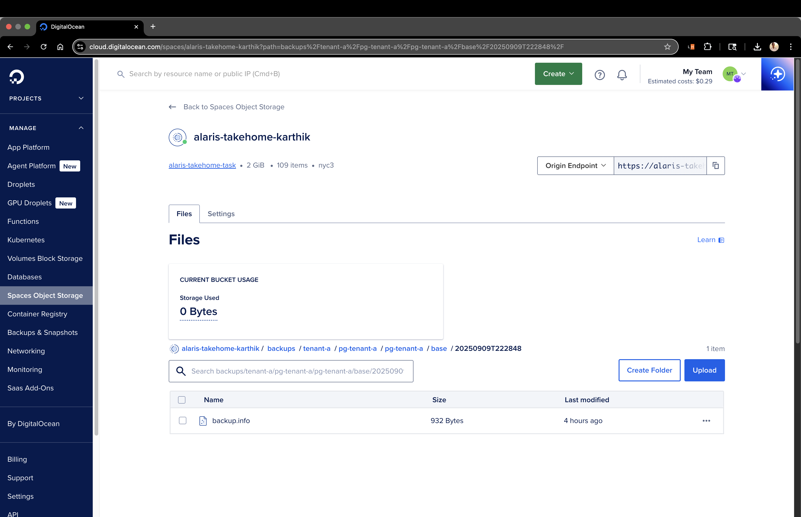
- Bootstrap Ops 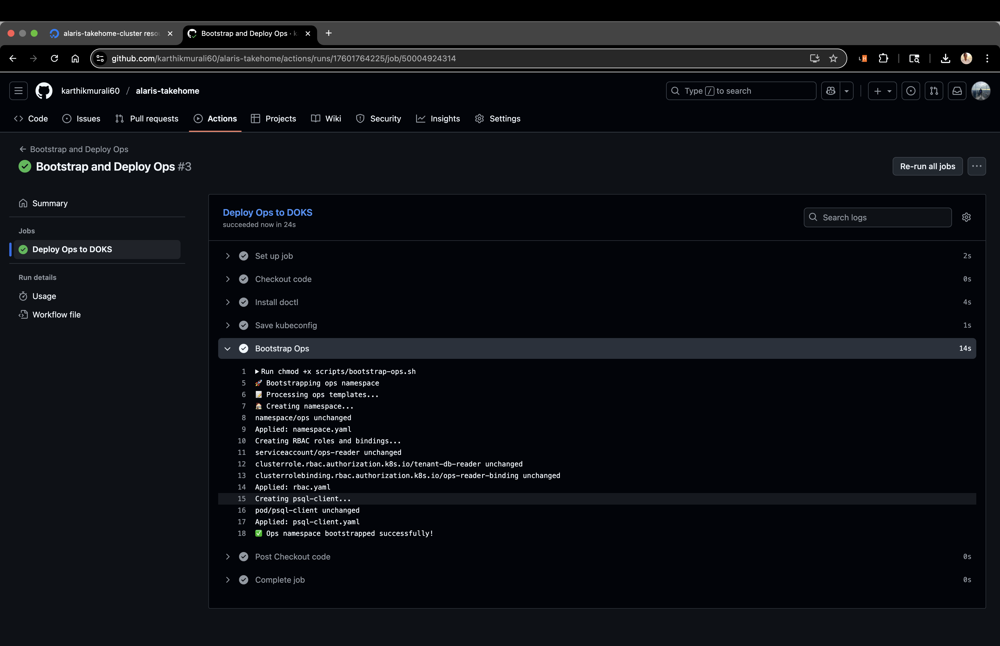
- Bootstrap Tenant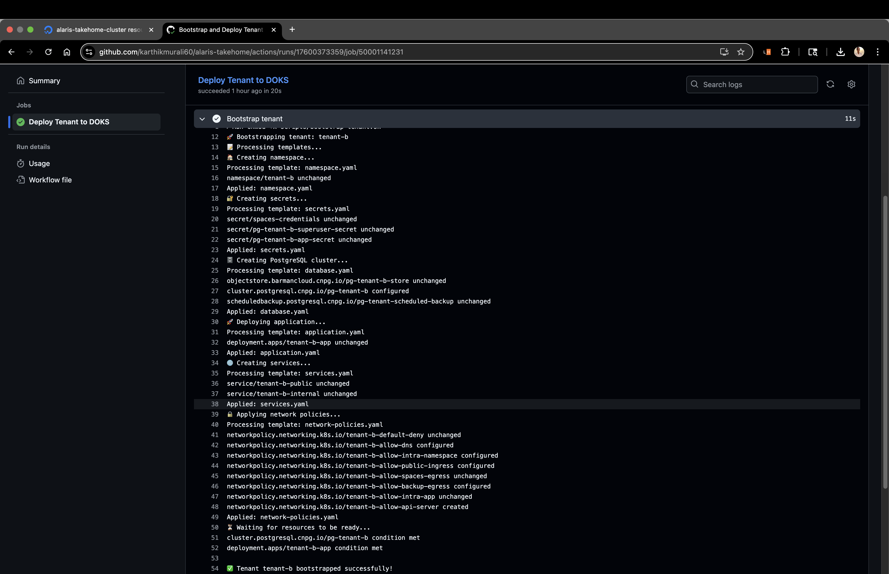
- Container Registry with images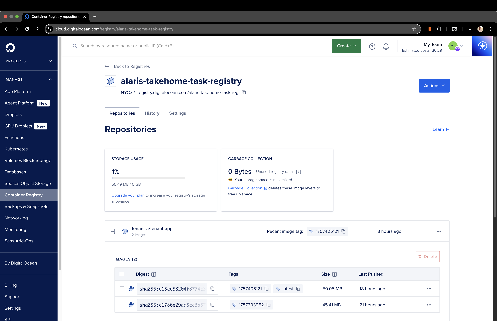
- Internal Endpoint not reachable over internet 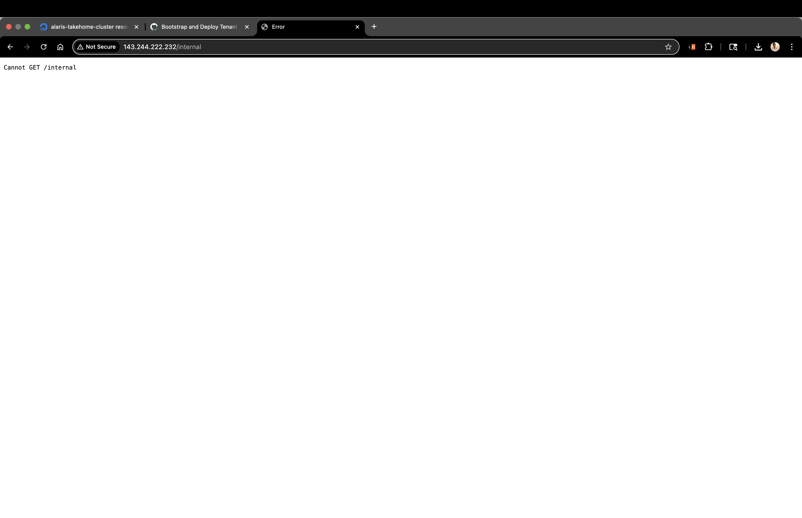
- Kubernetes Cluster 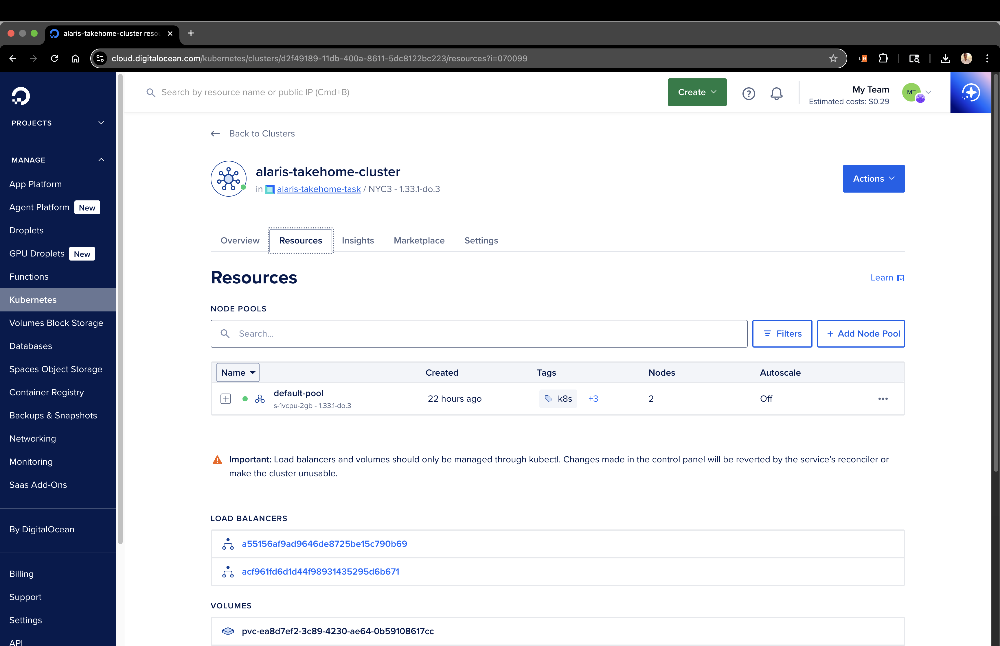
- Public Endpoint reachable over internet 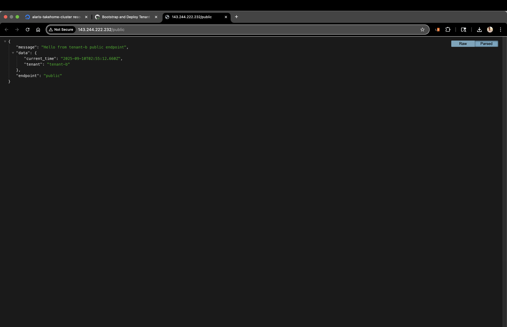
- Tenant resources 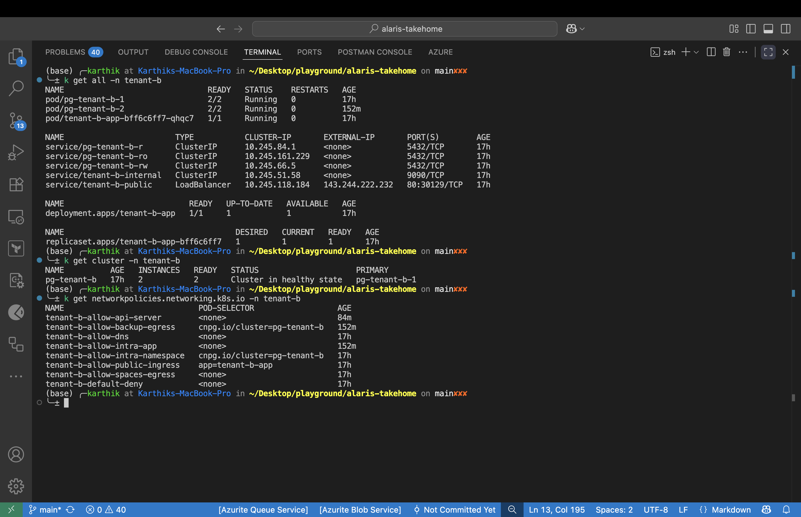
- Terraform remote backend 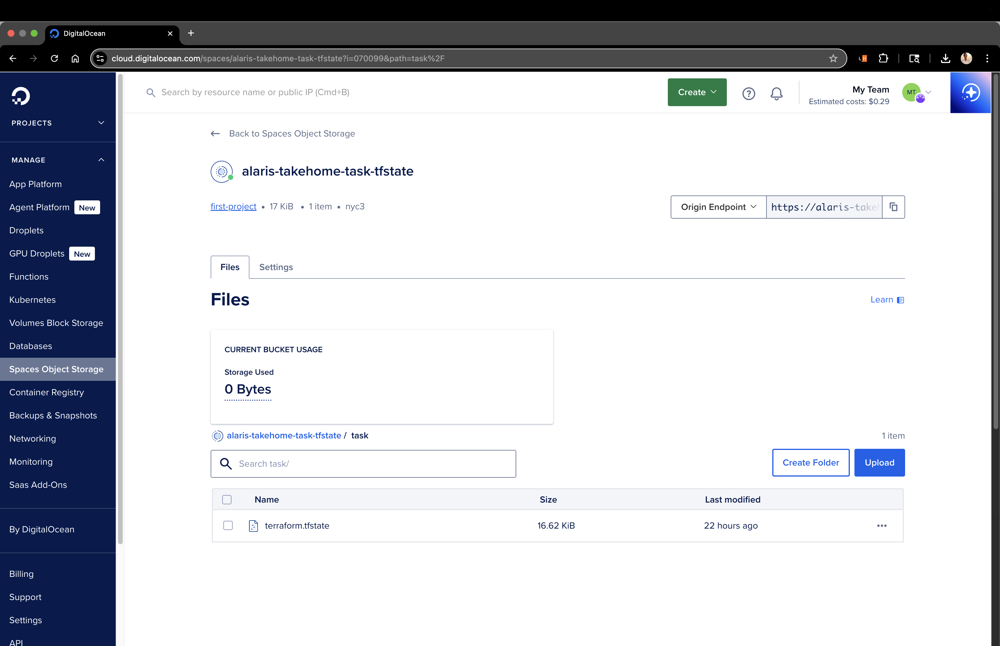
- Volumes 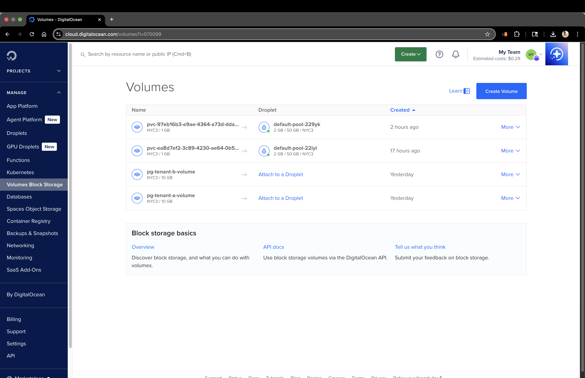
- WALs backups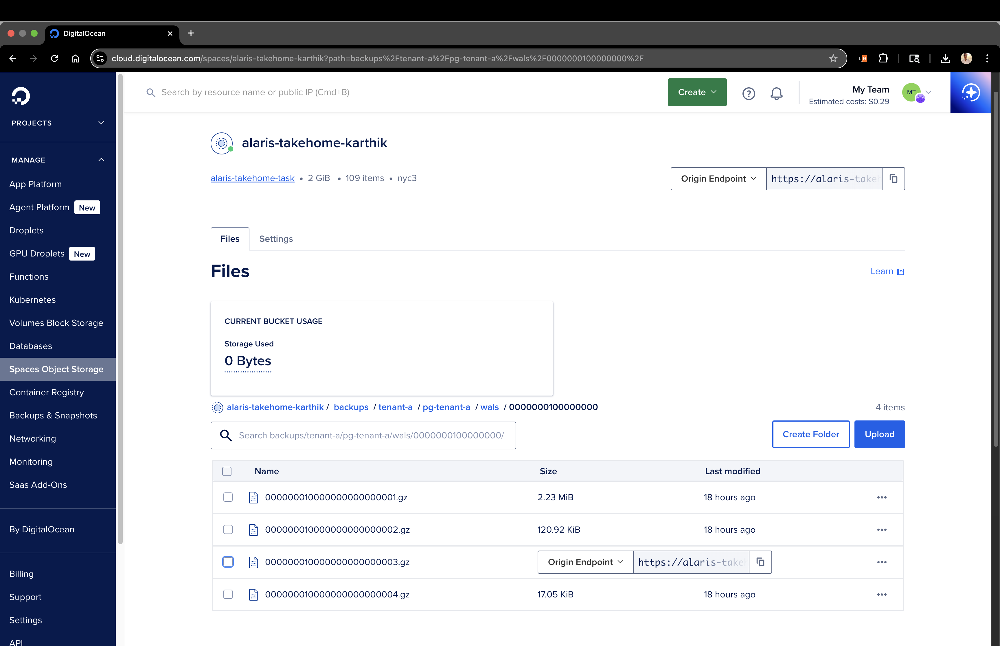
